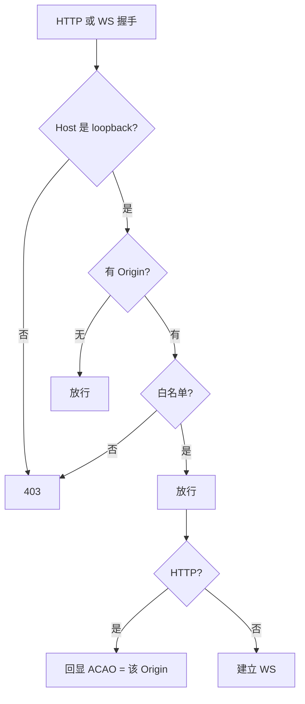

# 自研 MCP 本地桥 CORS / Origin 安全

> 实现：`tools/mcp-cocos-inspector/local-origin-guard.mjs`  
> 接入：HTTP 共享服 `share-http.mjs`（默认 `17374`）、WebSocket 桥 `bridge-server.mjs`（默认 `17373`）  
> 相关：多实例说明见 [inspector-mcp-multi-instance.md](./inspector-mcp-multi-instance.md)

## 1. 为什么需要

Cocos Inspector MCP **不是**把试玩页直接暴露给公网，而是本机常驻桥：

```text
试玩页 / 扩展  ──WS──►  127.0.0.1:17373  ◄──  Cursor MCP Client
试玩页 / 扩展  ──HTTP─► 127.0.0.1:17374  （大图共享、/api/*）
```

浏览器里任意网页都可以对 `http://127.0.0.1:端口` 发请求。若本地桥：

- 监听在 `0.0.0.0`，或
- `Access-Control-Allow-Origin: *`，或
- 不校验 `Host` / `Origin`

则恶意页可借用户本机浏览器调用桥接 API（读场景、下纹理、写共享目录等）。  
因此本地桥必须同时做 **Host 锁死 loopback** + **Origin 白名单** + **禁止通配 CORS**。

## 2. 威胁模型

| 威胁 | 说明 | 对策 |
|------|------|------|
| 恶意网页直连 localhost | 用户浏览攻击页时，页面对 `127.0.0.1:17374` 发 XHR/fetch | Origin 白名单；非白名单不回 ACAO，且请求直接 `403` |
| DNS Rebinding | 攻击域先解析到攻击者 IP，再把 DNS 改成 `127.0.0.1`，绕过同源 | `Host` 必须是 `127.0.0.1` / `localhost` / `::1` |
| 通配 CORS | `ACAO: *` 让任意 Origin 的浏览器可读响应 | **禁止 `*`**；仅对已通过校验的 Origin **回显** ACAO |
| `Origin: null` | 沙箱 / 部分 `file://` 场景常带 `null` | 显式拒绝 |
| 路径穿越 | HTTP 读共享目录时 `../` 逃出 `tmp/mcp-share` | `joinSafe` 校验绝对路径前缀（见 `share-http.mjs`） |

**不在本模型内（已知边界）：**

- 同机恶意进程可直接连 loopback（无 Origin）；靠本机用户信任边界，不靠 CORS
- Node / MCP / curl 无 `Origin` 头时放行——这是设计意图，便于 Agent 与脚本调用
- 扩展 ID 未做固定白名单：任意已安装的 `chrome-extension://` / `moz-extension://` Origin 均放行

## 3. 防护规则（实现契约）

入口统一走 `assertLocalBridgeRequest(req)`（HTTP）或 `verifyLocalBridgeClient`（WS `verifyClient`）。

### 3.1 Host（防 DNS Rebinding）

`Host`（取逗号分隔第一段）的主机名必须是：

- `127.0.0.1`
- `localhost`
- `::1`（含 `[::1]:port` 形式）

否则：`403`，错误形如 `拒绝非 loopback Host: ...`。

服务端监听本身也绑在 `127.0.0.1`（见 `share-http.mjs` 的 `listen(port, '127.0.0.1')`），Host 校验是第二道闸。

### 3.2 Origin

| 情况 | 结果 |
|------|------|
| 无 `Origin` / 空 | **允许**（MCP、Node、curl） |
| `Origin: null` | **拒绝** |
| 非法 URL | **拒绝** |
| `chrome-extension://…` / `moz-extension://…` | **允许** |
| `http(s)://127.0.0.1` / `localhost` / `::1` | **允许** |
| 主机名匹配动态白名单（见下） | **允许** |
| 匹配 `COCOS_BRIDGE_ALLOWED_ORIGINS` | **允许** |
| 其它 | **拒绝** → `403` `拒绝 Origin: ...` |

### 3.3 CORS 响应头（仅 HTTP）

`applyCorsHeaders(headers, origin)`：

- 仅当 `origin` 存在且 `isAllowedOrigin(origin)` 为真时设置：
  - `Access-Control-Allow-Origin: <该 origin>`（回显，不是 `*`）
  - `Vary: Origin`
  - `Access-Control-Allow-Methods: GET, HEAD, PUT, POST, OPTIONS`
  - `Access-Control-Allow-Headers: Content-Type`
- 未通过白名单：**不写 ACAO**，浏览器侧跨域读响应失败；服务端仍可先因 `assertLocalBridgeRequest` 直接 `403`

`OPTIONS` 预检同样先过 Host/Origin 门闸，再回 `204` + 上述头。

## 4. Origin 白名单来源

动态集合在进程内维护（`addAllowedHostname` / `addAllowedDomainHint`）：

| 来源 | 时机 |
|------|------|
| 守护进程 `--domain` / `COCOS_INSPECTOR_DOMAIN` | `setDaemonMeta` |
| `--page-url-match` / `COCOS_PAGE_URL_MATCH` | 短名存为 `*.{match}` 后缀提示 |
| 扩展上报的试玩域名 | WS 握手 / 消息里的 `reportedDomain` 等 |

环境变量（静态额外放行）：

```text
COCOS_BRIDGE_ALLOWED_ORIGINS=https://play.example.com,https://*.cdn.example.com
```

- 逗号 / 分号 / 空白分隔
- 支持完整 Origin，或 `https://*.example.com` / `http://*.example.com` 形式通配（含子域）

## 5. 请求判定流程



## 6. 配置与运维

### 6.1 正常开发（推荐）

```powershell
npm run cocos-bridge -- --domain play.godeebxp.com --page-url-match godeebxp
```

试玩页 Origin（如 `https://play.godeebxp.com`）由 `--domain` / 扩展上报写入动态白名单，无需再配环境变量。

### 6.2 额外域名

试玩页与 `--domain` 不一致、或走 CDN 子域时：

```powershell
$env:COCOS_BRIDGE_ALLOWED_ORIGINS = "https://cdn.example.com,https://*.example.com"
npm run cocos-bridge -- --domain play.example.com
```

### 6.3 自测门闸

```powershell
# 应 403：伪造 Host
curl -s -o NUL -w "%{http_code}" -H "Host: evil.com" http://127.0.0.1:17374/api/status

# 应 403：恶意 Origin
curl -s -o NUL -w "%{http_code}" -H "Origin: https://evil.example" http://127.0.0.1:17374/api/status

# 应 200：无 Origin（脚本 / MCP）
curl -s -o NUL -w "%{http_code}" http://127.0.0.1:17374/api/status
```

浏览器控制台从非白名单站 `fetch('http://127.0.0.1:17374/api/status')` 应失败（`403` 或 CORS 阻挡）。

## 7. 代码索引

| 模块 | 职责 |
|------|------|
| `local-origin-guard.mjs` | Host / Origin 判定、CORS 头、WS `verifyClient` |
| `share-http.mjs` | 每个请求 `assertLocalBridgeRequest` + `applyCorsHeaders` |
| `bridge-server.mjs` | WS `verifyLocalBridgeClient`；注册动态域名 |

日志与排错：拒绝时响应体含 `error` 字段（JSON API）或连接直接被 WS 拒绝；排查「试玩页调不通 17374」时先看 Origin 是否已进动态白名单或环境变量。

## 8. 设计原则（给后续改动）

1. **永不**对本地桥设置 `Access-Control-Allow-Origin: *` 或反射任意未校验 Origin  
2. **永不**把共享 HTTP / WS 绑到非 loopback，除非另有认证层并更新本文档  
3. 新增 HTTP/WS 入口必须复用 `assertLocalBridgeRequest` / `verifyLocalBridgeClient`，禁止旁路  
4. 放宽白名单优先用 `COCOS_BRIDGE_ALLOWED_ORIGINS` 或 daemon `--domain`，避免改成「任意 Origin」  
5. 一次性调试脚本可用无 Origin 的 curl/Node，不要为了图省事在页面里开 `*`  

## 9. 与「三世界隔离」的关系

技术难点文档中的 MCP 模型：

- **扩展世界**：Chrome Extension（`chrome-extension://` Origin 放行）  
- **试玩页世界**：仅白名单域名可跨域碰本地 HTTP  
- **MCP / Node 世界**：无 Origin，本机进程调用  

CORS / Origin 门闸保证：**只有扩展与已声明的试玩域**能在浏览器里触达本地桥；Agent 仍走本机无 Origin 通道，不被浏览器同源策略束缚。
